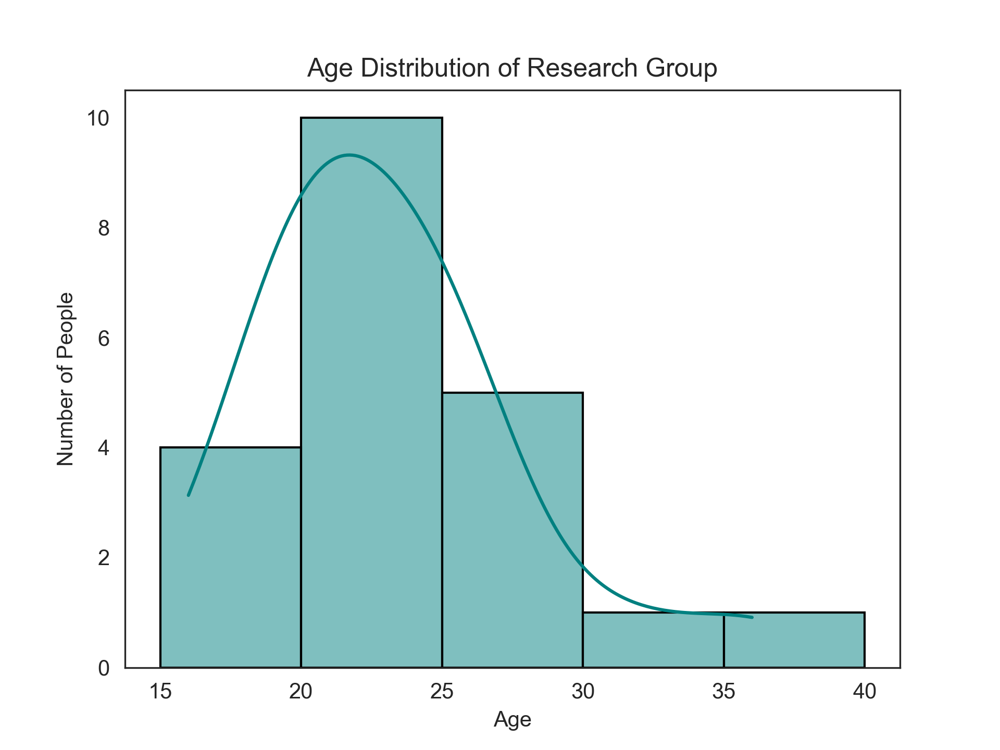
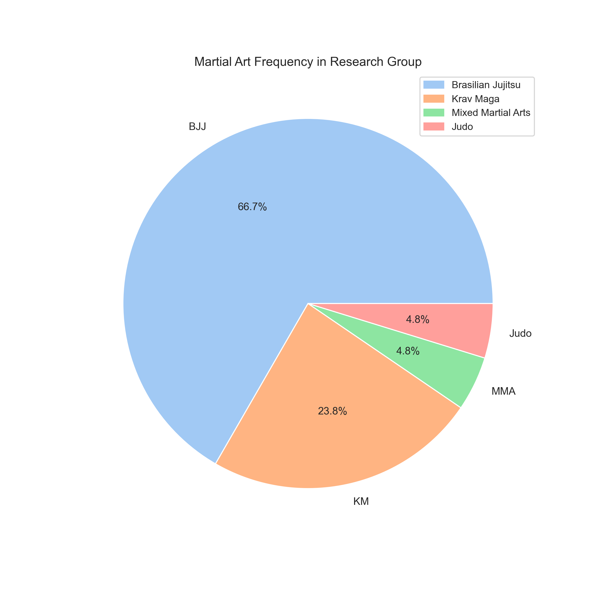
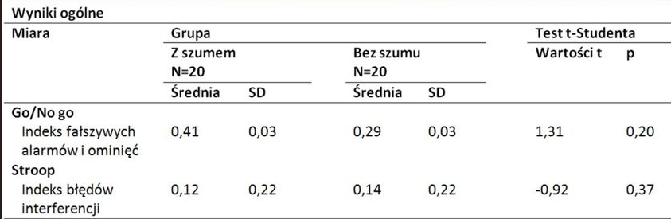
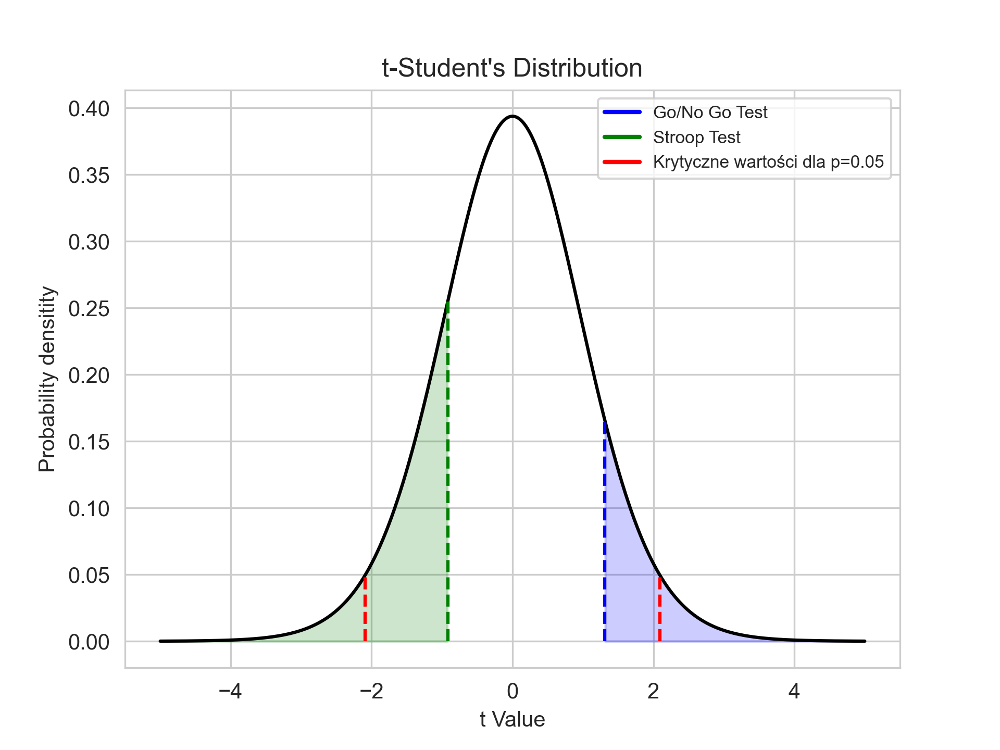

# Influence of White Noise on Athletes' Attention: A Psycho-Acoustic Experiment

This repository presents a unique psycho-acoustic experiment that explores the potential influence of white noise on athletes' attention, particularly those engaged in martial arts. The experiment is rooted in the hypothesis derived from Strelau's Temperament Theory, asserting that these athletes typically exhibit low reactivity.

Given our seminar's focus on the psychology of sound and music, we were intrigued to take a more cognitive and experimental approach to the subject. Consequently, we decided to investigate white noise, given its ubiquity and potential cognitive implications.

Our subject group consisted of 21 athletes, aged between 16 and 40 (with a right-skewed age distribution). The majority of the participants trained in Brazilian Jiu-Jitsu (BJJ), with others practicing Krav Maga, Mixed Martial Arts (MMA), and Judo.

We used the FZC-ZT Questionnaire to measure temperament and two custom tests, designed using PsychoPy based on relevant literature. The tests, namely the Counting Stroop and Go/No go test, served as our primary tools for gauging attention under the influence of white noise set at a consistent 77 Db.

Despite the challenges we encountered during the experiment design in PsychoPy and data analysis in R, this project represents an exciting foray into uncharted territories of psycho-acoustic research and psychology experimentation.

## Research Group Profile

Our study encompassed a group of 21 martial arts athletes. After the inital analysis, scores of one was dropped due to methodological reasons. Below is a more detailed breakdown of the participants.

### Age Distribution

Here, we provide a histogram showcasing the age distribution among the athletes, with ages ranging from 16 to 40. This distribution is right-skewed, indicating a higher number of younger participants in the study.

### Martial Arts Discipline Breakdown

In this pie chart, we illustrate the diverse mix of martial arts disciplines practiced by our participants, including Brazilian Jiu-Jitsu (BJJ), Krav Maga, Mixed Martial Arts (MMA), and Judo.

## Methodology

The experimental procedure was centered on two custom tests designed using PsychoPy, based on relevant literature: The Counting Stroop and Go/No go test. We complemented these attentional tests with the FZC-ZT Questionnaire to measure the participants' temperament.

## Results and Discussion

The results of our experiment brought forth interesting observations and insights.

### FCZ-KT Temperament Assessment

As hypothesized, the athletes did demonstrate low reactivity according to the FCZ-KT questionnaire. The average score was 2.95 stanins, reinforcing the premise of our study that martial arts athletes have low inherent reactivity.

### Cognitive Tests Outcomes

In terms of our primary hypothesis, the results did not support the expected influence of white noise on athletes' attention. Here are the detailed statistics for the two cognitive tests:

The T-Student test for both the cognitive tests yielded the following results:

- Go/no go test: t = 1.31, p = 0.20
- Stroop test: t = -0.92, p = 0.37

Given these p-values, we failed to reject the null hypothesis that there is no significant difference in attention measures between the group subjected to white noise and the control group.

Despite the results not supporting our initial hypothesis, this experiment has paved the way for further investigations into the intricate interplay of psycho-acoustic factors and cognitive performance in athletes.

